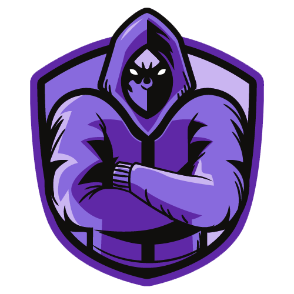
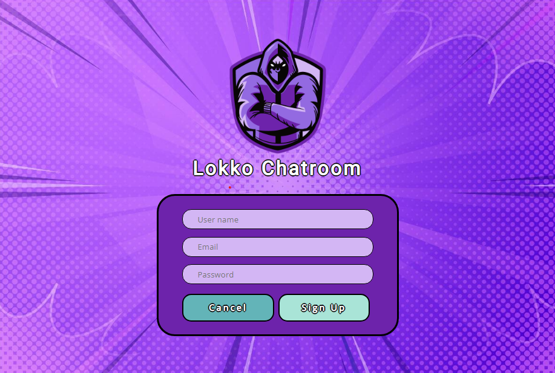
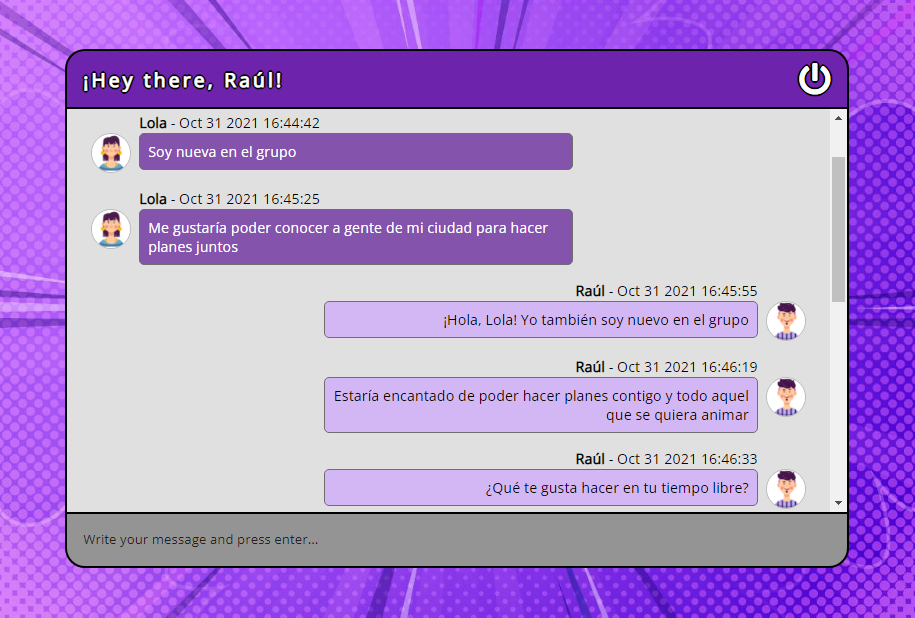

<p align="center">
  
</p>

Introducción
-------------
Un chat desarrollado con Vue3 y Composition API para el front, y Firebase en el back para la autenticación de usuarios, para el uso de Firestore como base de datos y para el propio hosting del proyecto. Para acceder al chat, [pulsa aquí](https://lokko-chatroom.web.app/).


<p align="center">
  
  
</p>

Descripción
-------------
* Aplicación con diseño responsive.
* Uso de Firebase Auth para la autenticación de usuarios.
* Uso de Firestore como base de datos para los mensajes del chat.
* Uso de Firebase hosting para albergar el proyecto.

Setup 
-------------
```
npm install
```
### Frontend
```
npm run serve
```
### Compilación para producción
```
npm run build
```

Características
-------------
* HTML5, CSS3, JS
* [Vue.js](https://v3.vuejs.org/)
* [Composition API](https://v3.vuejs.org/api/composition-api.html)
* [Firebase Auth](https://firebase.google.com/docs/auth)
* [Firestore](https://firebase.google.com/docs/firestore)
* [Firebase Hosting](https://firebase.google.com/docs/hosting)
